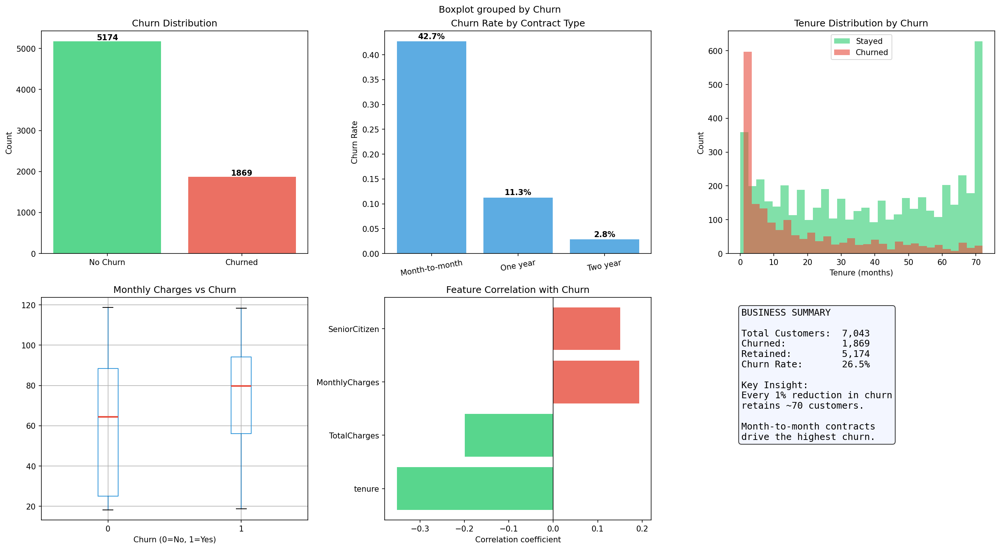
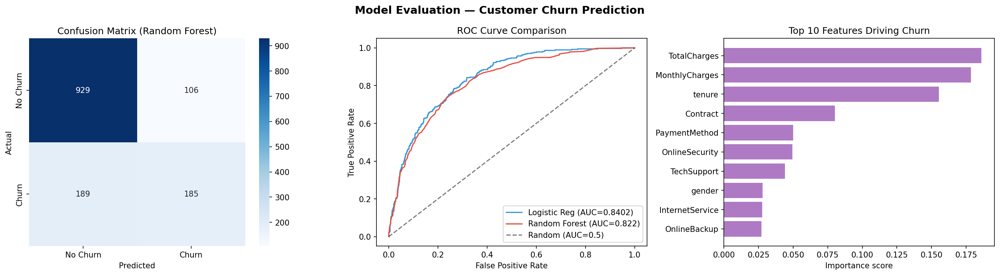

# Customer Churn Analysis

This project came out of a straightforward question: can you predict which telecom customers are about to leave, and what's actually driving them out the door?

The dataset is the Telco Customer Churn dataset — 7,043 customers with demographics, account details, services subscribed, and whether they churned. I did the full pipeline in Python: cleaning, EDA, feature engineering, and two classification models compared head to head.

---

## What I found

**26.5% of customers churned.** That's above the typical industry average of ~20%, which means this is an active business problem, not background noise.

The single clearest pattern: **contract type drives churn more than anything else.**

| Contract Type | Churn Rate |
|---|---|
| Month-to-month | 42.7% |
| One year | 11.3% |
| Two year | 2.8% |

Month-to-month customers churn at 15x the rate of two-year contract holders. The business implication is obvious — locking customers into longer contracts dramatically reduces churn risk, and any retention campaign should prioritise converting month-to-month customers first.

**Tenure matters too.** Churn is heavily concentrated in the first few months. Customers who make it past 12 months tend to stay. That's a classic pattern — if you can get someone through the early friction, they're much less likely to leave.

**Higher monthly charges correlate with higher churn.** Churned customers had a median monthly charge of ~£80 vs ~£65 for retained customers. This suggests price sensitivity is a real factor, particularly for customers on premium plans without long-term contracts.

---

## The models

I ran two classifiers and compared them:

| Model | Accuracy | AUC |
|---|---|---|
| Logistic Regression | ~80% | 0.840 |
| Random Forest | ~80% | 0.822 |

Logistic Regression edged out Random Forest on AUC (0.840 vs 0.822), which was a bit surprising — usually ensemble methods win on tabular data. But the dataset is relatively small (7k rows) and the signal is fairly linear (contract type, tenure, charges), so logistic regression handles it well.

The top features driving churn according to the Random Forest:
1. **TotalCharges** — proxy for tenure × spend
2. **MonthlyCharges** — price sensitivity
3. **tenure** — how long they've been a customer
4. **Contract type** — the strongest categorical signal
5. **PaymentMethod** — electronic check users churn more




---

## Data notes

A few things needed fixing before modelling:

- `TotalCharges` came in as a string (should be numeric) — 11 rows had blank values that became NaN after coercion, filled with the median
- `customerID` dropped — it's an identifier, not a feature
- All categorical columns label-encoded before feeding into models
- Features standardised with `StandardScaler` before logistic regression

---

## Business recommendations

**Convert month-to-month customers.** Offer incentives for annual plans — even a small discount pays off given the 42.7% vs 2.8% churn rate difference.

**Invest in the first 12 months.** Proactive outreach, onboarding support, and loyalty offers targeted at customers with tenure < 12 months would have the highest ROI.

**Watch high-charge, no-contract customers.** This combination — high monthly spend, month-to-month contract — is the highest risk profile. A targeted retention offer here makes financial sense.

Every 1% reduction in churn retains ~70 customers. At average monthly revenue, that compounds quickly.

---

## Files

```
Customer churn Analysis/
├── customer_churn_analysis.ipynb   # Full analysis notebook
├── Telco customer churn data.csv   # Raw dataset
├── churn_eda.png                   # EDA charts
└── churn_model_results.png         # Model evaluation charts
```

## Stack

Python 3 — pandas, scikit-learn, matplotlib, seaborn
